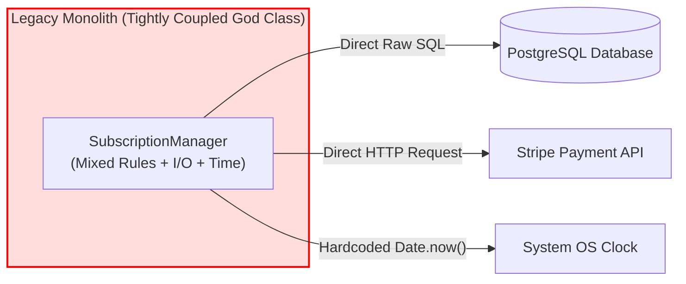
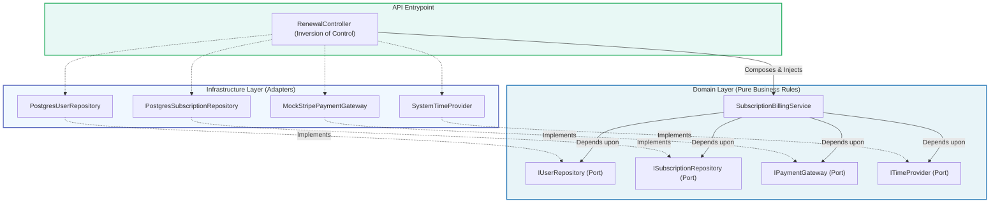
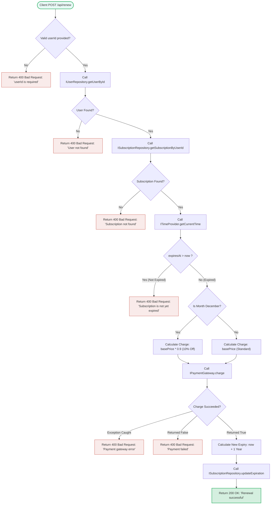
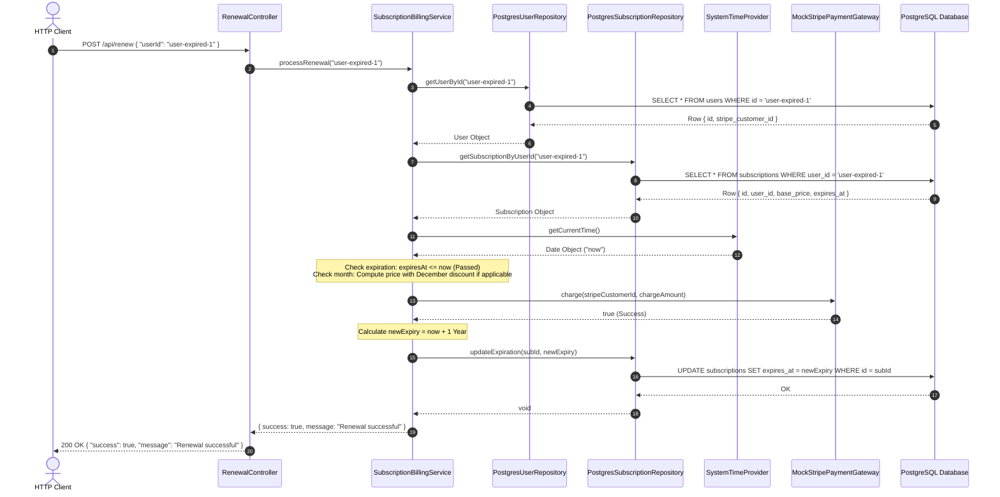

<div align="center">

# ⚡ Enterprise Subscription Billing Engine
### *Refactored Legacy "God Class" into SOLID Hexagonal Architecture*

[](https://nodejs.org/)
[](https://www.typescriptlang.org/)
[](https://www.postgresql.org/)
[](https://www.docker.com/)
[](https://jestjs.io/)
[](#-architecture-overview)

<p align="center">
  A production-grade, highly modular, deterministic, and unit-testable Subscription Renewal Engine refactored from an untestable legacy monolith into a clean Ports & Adapters (Hexagonal) architecture.
</p>

</div>

---

## 📑 Table of Contents
- [📌 Project Overview](#-project-overview)
- [🎯 Business Problem & Core Objectives](#-business-problem--core-objectives)
- [🛠️ Tech Stack & Technologies](#️-tech-stack--technologies)
- [🏛️ Architecture Overview](#️-architecture-overview)
- [🔄 Detailed Execution & Workflow Diagrams](#-detailed-execution--workflow-diagrams)
- [📁 Project & Folder Organization](#-project--folder-organization)
- [⚙️ Setup & Installation](#️-setup--installation)
- [🚀 Running the Application](#-running-the-application)
- [🧪 Testing Strategy & Execution](#-testing-strategy--execution)
- [📡 API Reference & Verification](#-api-reference--verification)
- [📊 Test Data Reference](#-test-data-reference)
- [📚 Additional Documentation](#-additional-documentation)

---

## 📌 Project Overview

In fast-moving development lifecycles, billing systems frequently accumulate technical debt in monolithic "God Classes" that interleave business rules (pricing, discounts, date math), direct database queries, payment gateway HTTP calls, and non-deterministic operating system state (`new Date()`).

This project transforms a legacy `SubscriptionManager` into a decoupled, production-grade **Ports and Adapters (Hexagonal)** architecture in **TypeScript**, enforcing the **Single Responsibility Principle (SRP)** and **Dependency Inversion Principle (DIP)**.

### Key Highlights:
- **100% Deterministic Unit Testing:** Time and I/O are injected via domain ports, enabling complete test execution in milliseconds without database or network connectivity.
- **Pure Domain Isolation:** Core business logic has **zero external dependencies** on database drivers, ORMs, HTTP clients, or web frameworks.
- **Containerized One-Command Launch:** Ready for local development and CI/CD pipelines via `docker compose up -d` with automated schema migrations and seeding.

---

## 🎯 Business Problem & Core Objectives

### The Legacy Problem


* **Smell 1: Hidden Dependencies** — Instantiates database connections and HTTP clients directly inside business methods.
* **Smell 2: Temporal Coupling** — Invocations of `new Date()` make testing temporal rules (expiration dates, promotional calendar windows) non-deterministic.
* **Smell 3: I/O Interleaving** — Core rules are tangled with persistence logic and external gateway responses.

### The Solution: Hexagonal Architecture (Ports & Adapters)


---

## 🛠️ Tech Stack & Technologies

| Layer / Concern | Technology | Purpose |
| :--- | :--- | :--- |
| **Language & Typing** | TypeScript (v5.4) / Node.js (v22) | Strong typing, explicit interface definition, and type safety |
| **API Framework** | Express.js (v4.19) | Lightweight HTTP routing and boundary controller handling |
| **Database** | PostgreSQL 15 | Relational persistence with ACID compliance and foreign key constraints |
| **Database Client** | `pg` (node-postgres) | Connection pool and parameterized SQL query execution |
| **Testing Framework** | Jest & `ts-jest` | Fast, isolated unit testing and supertest integration testing |
| **Containerization** | Docker & Docker Compose | Container orchestration with healthchecks and auto-seeding |

---

## 🏛️ Architecture Overview

The system strictly adheres to the **Clean / Onion / Hexagonal Architecture** dependency rule:

```
[ HTTP Request (API Layer) ]
           │
           ▼
[ API Controller (RenewalController) ] ── (Inversion of Control)
           │
   Injects Adapters into Service
           │
           ▼
┌────────────────────────────────────────────────────────┐
│                   DOMAIN CORE LAYER                    │
│                                                        │
│  ┌──────────────────────────────────────────────────┐  │
│  │     SubscriptionBillingService (Business Rules)  │  │
│  └──────────────────────────────────────────────────┘  │
│                           │                            │
│                  Depends on Abstractions               │
│                           ▼                            │
│  ┌──────────────────────────────────────────────────┐  │
│  │                 DOMAIN PORTS                     │  │
│  │   • ISubscriptionRepository                      │  │
│  │   • IUserRepository                              │  │
│  │   • IPaymentGateway                              │  │
│  │   • ITimeProvider                                │  │
│  └──────────────────────────────────────────────────┘  │
└────────────────────────────────────────────────────────┘
                            ▲
                            │ Implements Ports
┌───────────────────────────┴────────────────────────────┐
│              INFRASTRUCTURE ADAPTERS LAYER             │
│                                                        │
│  • PostgresSubscriptionRepository ──> PostgreSQL DB    │
│  • PostgresUserRepository         ──> PostgreSQL DB    │
│  • MockStripePaymentGateway       ──> Payment Gateway  │
│  • SystemTimeProvider             ──> Operating System │
└────────────────────────────────────────────────────────┘
```

---

## 🔄 Detailed Execution & Workflow Diagrams

### 1. Subscription Renewal Flowchart



### 2. Sequence Diagram: Successful Renewal



---

## 📁 Project & Folder Organization

```
subscription-billing-engine/
├── .env.example                          # Environment variable template
├── .gitignore                            # Git ignore rules
├── answers.md                            # Architectural questionnaire answers
├── architecture.md                       # Comprehensive architecture documentation
├── docker-compose.yml                     # Multi-container orchestration (API + DB)
├── Dockerfile                             # Multi-stage Docker build
├── jest.config.js                         # Jest test suite configuration
├── package.json                          # Dependencies & NPM scripts
├── projectdocumentation.md               # End-to-end engineering documentation
├── README.md                              # Main visual project documentation
├── submission.json                        # Test data mapping for evaluation
├── tsconfig.json                          # TypeScript compiler settings
│
├── docs/
│   └── ADR-001-Refactoring-God-Class.md   # Formal Architecture Decision Record
│
├── legacy/
│   └── LegacySubscriptionManager.ts       # Smelly legacy God-class reference
│
├── src/
│   ├── api/
│   │   ├── controllers/
│   │   │   └── RenewalController.ts       # Route handler & Dependency Injection root
│   │   └── server.ts                      # Express application factory
│   │
│   ├── domain/
│   │   ├── models/                        # Pure data entities (no frameworks)
│   │   │   ├── Subscription.ts
│   │   │   └── User.ts
│   │   ├── ports/                         # Abstract Port interfaces
│   │   │   ├── IPaymentGateway.ts
│   │   │   ├── ISubscriptionRepository.ts
│   │   │   ├── ITimeProvider.ts
│   │   │   └── IUserRepository.ts
│   │   └── services/
│   │       └── SubscriptionBillingService.ts # Core business logic engine
│   │
│   ├── infrastructure/
│   │   ├── adapters/                      # Concrete Port implementations
│   │   │   ├── MockStripePaymentGateway.ts
│   │   │   ├── PostgresSubscriptionRepository.ts
│   │   │   ├── PostgresUserRepository.ts
│   │   │   └── SystemTimeProvider.ts
│   │   └── database/
│   │       ├── db.ts                      # PostgreSQL connection pool
│   │       └── init.sql                   # Schema DDL & automated seed fixtures
│   │
│   └── index.ts                           # Server bootloader & process entrypoint
│
└── tests/
    ├── integration/
    │   └── renew.test.ts                  # HTTP API integration tests
    └── unit/
        └── SubscriptionBillingService.test.ts # 100% isolated domain unit tests
```

---

## ⚙️ Setup & Installation

### Prerequisites
- [Node.js](https://nodejs.org/) (v18+ or v22 LTS recommended)
- [Docker & Docker Compose](https://www.docker.com/)
- [Git](https://git-scm.com/)

### 1. Clone & Install Dependencies
```bash
git clone https://github.com/ramalokeshreddyp/subscription-billing-engine.git
cd subscription-billing-engine
npm install
```

### 2. Environment Configuration
Copy the sample environment variables:
```bash
cp .env.example .env
```

---

## 🚀 Running the Application

### Option A: Running with Docker Compose (Recommended)
Launch the API and PostgreSQL with a single command:
```bash
docker compose up --build -d
```

Check service status and health:
```bash
docker compose ps
```

View application logs:
```bash
docker compose logs -f api
```

### Option B: Running Locally (Node.js)
1. Ensure PostgreSQL is running on `localhost:5432` with database `subscription_billing` (or apply `src/infrastructure/database/init.sql`).
2. Build TypeScript and start:
```bash
npm run build
npm start
```
Or run directly in development mode with `ts-node`:
```bash
npm run dev
```

---

## 🧪 Testing Strategy & Execution

### 1. Isolated Unit Tests (Sandboxed, No DB required)
Unit tests evaluate domain business rules using constructor-injected mocks and stubs:
```bash
npm run test:unit
```

### 2. Full Test Suite with Coverage
```bash
npm test
```

#### Coverage Results:
```text
-------------------------------|---------|----------|---------|---------|
File                           | % Stmts | % Branch | % Funcs | % Lines |
-------------------------------|---------|----------|---------|---------|
All files                      |     100 |      100 |     100 |     100 |
 SubscriptionBillingService.ts |     100 |      100 |     100 |     100 |
-------------------------------|---------|----------|---------|---------|
Test Suites: 2 passed, 2 total
Tests:       13 passed, 13 total
```

---

## 📡 API Reference & Verification

### Renew Subscription Endpoint
`POST /api/renew`

#### Request Headers
`Content-Type: application/json`

#### Request Body
```json
{
  "userId": "user-expired-1"
}
```

#### Success Response (`200 OK`)
```json
{
  "success": true,
  "message": "Renewal successful"
}
```

#### Business Rule Failure Responses (`400 Bad Request`)
* **Unexpired Subscription:**
  ```json
  {
    "success": false,
    "message": "Subscription is not yet expired"
  }
  ```
* **User Not Found:**
  ```json
  {
    "success": false,
    "message": "User not found"
  }
  ```
* **Payment Failure:**
  ```json
  {
    "success": false,
    "message": "Payment failed"
  }
  ```

---

## 📊 Test Data Reference

Pre-seeded test records defined in `src/infrastructure/database/init.sql` and mapped in `submission.json`:

| User ID | Subscription ID | Initial Expiration | Base Price | Expected `/api/renew` Outcome |
| :--- | :--- | :--- | :--- | :--- |
| `user-expired-1` | `sub-expired-1` | `2023-01-01 00:00:00` (Past) | $100.00 | `200 OK` (Renewed, expiration +1 Year) |
| `user-active-1` | `sub-active-1` | `2099-12-31 23:59:59` (Future) | $150.00 | `400 Bad Request` ("Subscription is not yet expired") |
| `user-nonexistent` | N/A | N/A | N/A | `400 Bad Request` ("User not found") |

---

## 📚 Additional Documentation

- 🏛️ **[Architecture Guide (`architecture.md`)](./architecture.md)** — In-depth architectural decisions, Hexagonal pattern, SOLID compliance, and data contracts.
- 📖 **[Project Documentation (`projectdocumentation.md`)](./projectdocumentation.md)** — Comprehensive engineering guide, module specifications, and verification steps.
- 📝 **[Architecture Decision Record (`docs/ADR-001-Refactoring-God-Class.md`)](./docs/ADR-001-Refactoring-God-Class.md)** — Formal record of problems, decisions, and trade-offs.
- ❓ **[Questionnaire Answers (`answers.md`)](./answers.md)** — Evaluated architectural question responses.

---

<div align="center">
  <sub>Built with clean code and SOLID engineering practices.</sub>
</div>
