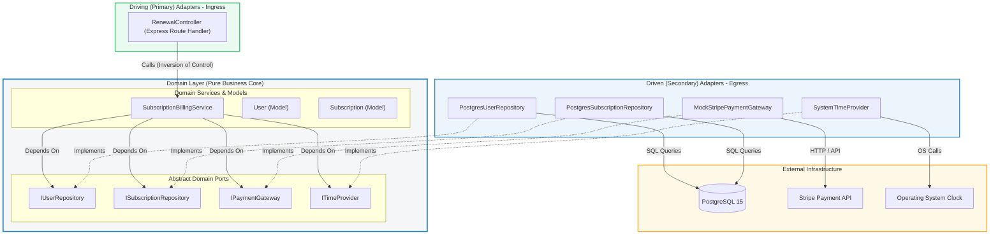
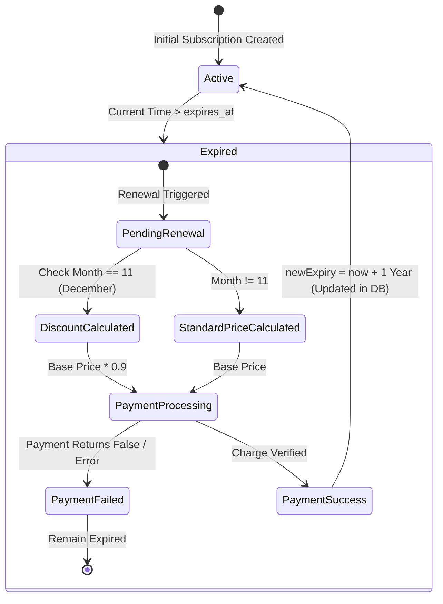
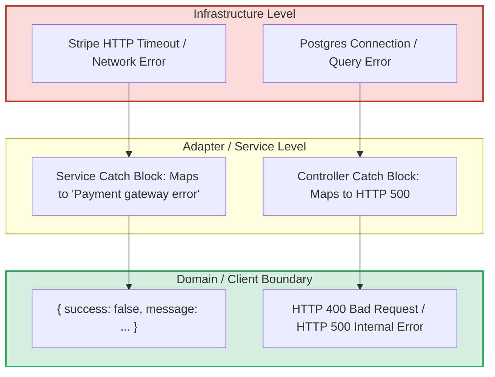

# 🏛️ Architecture Documentation: Subscription Billing Engine

## 📖 Executive Summary & Objectives

The **Subscription Billing Engine** was originally implemented as an untestable monolithic "God Class" that mixed database access, network I/O, temporal calls, and business rules. 

The primary objective of this refactoring is to establish a **Ports and Adapters (Hexagonal Architecture)** foundation governed by **SOLID design principles**, with the following goals:
1. **Decouple Domain Logic from Infrastructure:** Prevent database, network, framework, and operating system concerns from leaking into business policies.
2. **Achieve 100% Deterministic Testability:** Allow the entire suite of business rules (promotions, expiration logic, date math, failure handling) to run in-memory within milliseconds without database or network dependencies.
3. **Establish Inversion of Control (IoC):** Use Constructor Injection to supply dependencies at runtime boundaries rather than instantiating them internally.

---

## 🏗️ Hexagonal Architecture (Ports & Adapters)

In Hexagonal Architecture, the application core (Domain) is isolated from external technologies (Database, HTTP, Third-party APIs) via Ports (Interfaces). Concrete implementations (Adapters) reside on the outer rim and implement the ports.

---

## 📐 SOLID Principles Implementation Analysis

```mermaid
classDiagram
    class IUserRepository {
        <<interface>>
        +getUserById(userId: string) Promise~User | null~
    }
    class ISubscriptionRepository {
        <<interface>>
        +getSubscriptionByUserId(userId: string) Promise~Subscription | null~
        +updateExpiration(subscriptionId: string, newExpiry: Date) Promise~void~
    }
    class IPaymentGateway {
        <<interface>>
        +charge(customerId: string, amount: number) Promise~boolean~
    }
    class ITimeProvider {
        <<interface>>
        +getCurrentTime() Date
    }

    class SubscriptionBillingService {
        -subscriptionRepo: ISubscriptionRepository
        -userRepo: IUserRepository
        -paymentGateway: IPaymentGateway
        -timeProvider: ITimeProvider
        +processRenewal(userId: string) Promise~RenewalResult~
    }

    class PostgresUserRepository {
        -db: Pool
        +getUserById(userId: string) Promise~User | null~
    }
    class PostgresSubscriptionRepository {
        -db: Pool
        +getSubscriptionByUserId(userId: string) Promise~Subscription | null~
        +updateExpiration(subscriptionId: string, newExpiry: Date) Promise~void~
    }
    class MockStripePaymentGateway {
        -apiKey: string
        +charge(customerId: string, amount: number) Promise~boolean~
    }
    class SystemTimeProvider {
        +getCurrentTime() Date
    }

    SubscriptionBillingService --> IUserRepository : DIP (Depends on abstraction)
    SubscriptionBillingService --> ISubscriptionRepository : DIP (Depends on abstraction)
    SubscriptionBillingService --> IPaymentGateway : DIP (Depends on abstraction)
    SubscriptionBillingService --> ITimeProvider : DIP (Depends on abstraction)

    PostgresUserRepository ..|> IUserRepository : Implements Port
    PostgresSubscriptionRepository ..|> ISubscriptionRepository : Implements Port
    MockStripePaymentGateway ..|> IPaymentGateway : Implements Port
    SystemTimeProvider ..|> ITimeProvider : Implements Port
```

### 1. Single Responsibility Principle (SRP)
* **Legacy Smell:** `SubscriptionManager` parsed HTTP requests, executed database queries, performed date calculations, applied business pricing rules, and invoked Stripe APIs.
* **Refactored Solution:**
  * `SubscriptionBillingService` handles only domain renewal business policies.
  * `PostgresUserRepository` and `PostgresSubscriptionRepository` handle database persistence and SQL queries.
  * `MockStripePaymentGateway` handles external payment provider communication.
  * `SystemTimeProvider` handles clock access.
  * `RenewalController` handles HTTP routing, request validation, and status code mapping.

### 2. Open / Closed Principle (OCP)
* The billing engine is open for extension but closed for modification. Introducing a new payment provider (e.g., PayPal, Adyen) requires creating a new class implementing `IPaymentGateway` without changing `SubscriptionBillingService`.

### 3. Liskov Substitution Principle (LSP)
* Any implementation of `ISubscriptionRepository` (Postgres, MySQL, In-Memory Mock) or `ITimeProvider` (System Clock, Frozen Date Stub) can be substituted interchangeably without altering the correctness of `SubscriptionBillingService`.

### 4. Interface Segregation Principle (ISP)
* Ports are fine-grained and cohesive:
  * `IUserRepository` defines only user retrieval needed for billing.
  * `ISubscriptionRepository` defines only subscription retrieval and expiration updates.
  * `ITimeProvider` defines solely timestamp retrieval.

### 5. Dependency Inversion Principle (DIP)
* High-level domain modules (`SubscriptionBillingService`) do **not** depend on low-level infrastructure modules (`PostgresSubscriptionRepository`, `node-postgres`, `axios`).
* Both high-level and low-level modules depend on abstractions (`src/domain/ports/`).

---

## 🔬 Key Modules & Component Responsibilities

| Layer | Module / File | Responsibility |
| :--- | :--- | :--- |
| **Domain Models** | `User.ts`, `Subscription.ts` | Anemic domain models representing core entities with strongly typed properties. |
| **Domain Ports** | `ITimeProvider.ts` | Interface decoupling the concept of "now" from the system runtime clock. |
| **Domain Ports** | `IPaymentGateway.ts` | Interface abstracting customer payment operations. |
| **Domain Ports** | `ISubscriptionRepository.ts` | Interface abstracting subscription persistence and expiration updates. |
| **Domain Ports** | `IUserRepository.ts` | Interface abstracting user account queries. |
| **Domain Services**| `SubscriptionBillingService.ts`| Core engine executing business rules: validation, temporal checks, discounts, charge orchestration, and rollover. |
| **Adapters** | `SystemTimeProvider.ts` | Infrastructure adapter wrapping the native `new Date()` clock. |
| **Adapters** | `PostgresUserRepository.ts` | Infrastructure adapter querying the PostgreSQL `users` table. |
| **Adapters** | `PostgresSubscriptionRepository.ts` | Infrastructure adapter executing SQL queries and updates on the `subscriptions` table. |
| **Adapters** | `MockStripePaymentGateway.ts` | Infrastructure adapter simulating external payment processing. |
| **API Entrypoint** | `RenewalController.ts` | Entrypoint controller that composes dependencies and maps HTTP requests to service calls. |
| **API Entrypoint** | `server.ts`, `index.ts` | Express server creation, middleware configuration, and process lifecycle management. |

---

## 🔄 End-to-End Data Flow & State Transitions

### State Transition Diagram of a Subscription

---

## 🛠️ Technology Stack Rationale

| Technology | Reason for Selection | Alternative Considered | Trade-off / Decision |
| :--- | :--- | :--- | :--- |
| **TypeScript** | Compile-time type safety and explicit interface support for clean domain ports. | JavaScript (duck typing) / Python | TypeScript provides compile-time guarantees preventing interface contract mismatches. |
| **PostgreSQL 15** | Industry-standard ACID relational database with robust constraint enforcement. | SQLite / MongoDB | PostgreSQL represents production enterprise systems with strict foreign key integrity. |
| **Docker Compose** | Reproducible multi-service deployment with integrated health checks and migrations. | Local manual script | Eliminates "works on my machine" issues and automates database seeding. |
| **Jest & ts-jest** | Zero-dependency in-memory unit testing with built-in code coverage reporting. | Mocha / Chai | Jest provides fast mock lifecycle handling and granular coverage metrics. |

---

## ⚖️ Architectural Advantages & Trade-Offs

### Advantages
* **Deterministic Unit Testing:** Time and I/O can be simulated on demand. Testing a December discount rule does not require running tests in December or patching global runtime objects.
* **No Leaky Abstractions:** Database connection strings, SQL dialect quirks, and payment gateway HTTP status codes are completely hidden from domain logic.
* **Swappable Infrastructure:** Replacing the database with MongoDB, DynamoDB, or MySQL requires only adding a new adapter class without touching domain logic.

### Trade-offs & Mitigations
* **Increased File Count:** Moving from 1 monolithic file to 15 modular files increases structural boilerplate. *Mitigation: Standardized folder hierarchy and clean separation of concerns make enterprise scaling straightforward.*
* **Composition Overhead:** Dependencies must be composed at the application root. *Mitigation: Explicit composition in the controller or a lightweight DI container makes the dependency graph transparent.*

---

## 🛡️ Exception Handling & Error Isolation

* **No Leaked SQL/ORM Exceptions:** Domain services do not throw database driver errors.
* **Graceful Degradation:** Payment failures and gateway timeouts are mapped to clean domain responses without crashing the server.
