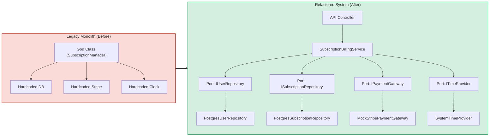
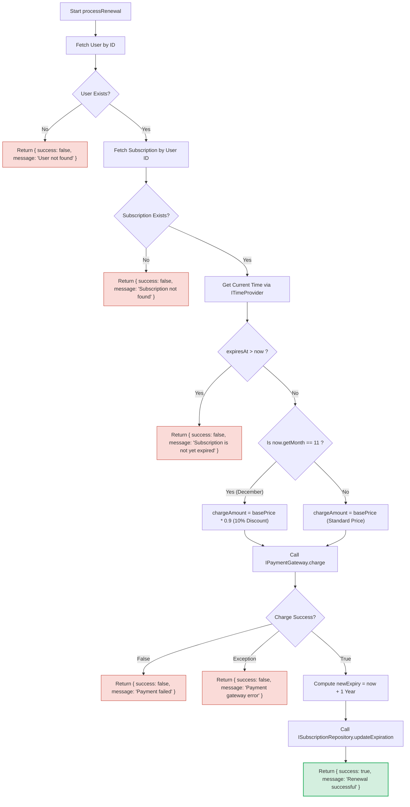
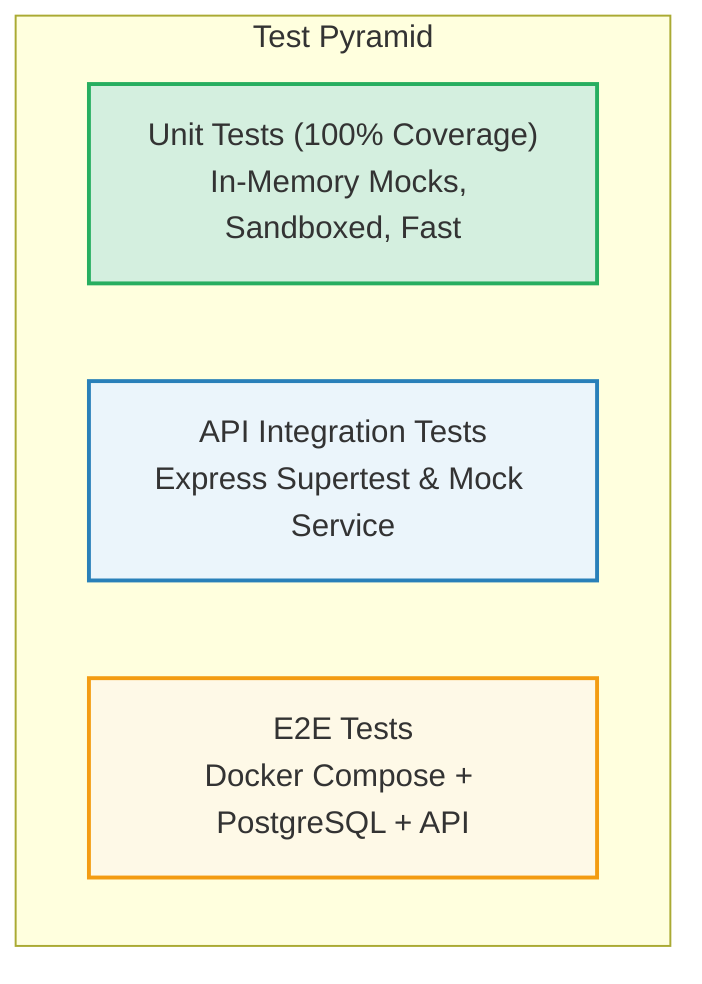

# 📘 Project Engineering Documentation: Subscription Billing Engine

## 1. Project Overview & Background

### 1.1 Problem Statement
The legacy `SubscriptionManager` module was a monolithic "God Class" suffering from severe architectural flaws:
* **Hidden Infrastructure Dependencies:** Direct instantiation of database connections (`new DatabaseConnection(...)`) and third-party payment clients (`new ThirdPartyPaymentClient(...)`) inside domain methods.
* **Temporal Coupling:** Direct invocations of the system clock (`new Date()`), making time-dependent business logic impossible to test deterministically without brittle global monkey-patching.
* **I/O and Business Logic Interleaving:** High-level business rules (pricing calculations, December discounts, expiration validations, and rollover math) were tightly interleaved with low-level SQL queries and network HTTP calls.
* **Zero Isolated Testability:** Testing any business rule required a running PostgreSQL instance, live network connectivity, and external payment API credentials.

### 1.2 Transformation Objective
To refactor the legacy billing engine into a production-grade **Ports & Adapters (Hexagonal)** architecture in **TypeScript**, applying the **Single Responsibility Principle (SRP)** and **Dependency Inversion Principle (DIP)**.



---

## 2. Business Rules & Domain Logic

The core domain service (`SubscriptionBillingService`) enforces the following business rules:



1. **User Existence Rule:** If the provided `userId` does not exist, return `{ success: false, message: "User not found" }`.
2. **Subscription Existence Rule:** If no subscription is associated with the `userId`, return `{ success: false, message: "Subscription not found" }`.
3. **Temporal Expiration Rule:** A subscription cannot be renewed before its expiration date. If `expiresAt > now`, return `{ success: false, message: "Subscription is not yet expired" }`.
4. **December Promotional Discount Rule:** If renewal occurs in December (`now.getMonth() === 11`), a 10% promotional discount is applied (`chargeAmount = basePrice * 0.9`). In all other months, the standard `basePrice` is charged.
5. **Payment Execution & Failure Rule:** The customer is charged via `IPaymentGateway.charge(customerId, chargeAmount)`. If the payment fails, return `{ success: false, message: "Payment failed" }`. If an unhandled gateway exception occurs, catch it and return `{ success: false, message: "Payment gateway error" }`.
6. **Expiration Rollover Rule:** Upon successful payment, exactly 1 year is added to the current time (`now`) for the next expiration date, and updated via `ISubscriptionRepository.updateExpiration(sub.id, newExpiry)`. Returns `{ success: true, message: "Renewal successful" }`.

---

## 3. Detailed Component Architecture

### 3.1 Domain Layer (`src/domain/`)
The domain layer is completely decoupled from frameworks, databases, and network libraries.

#### Models
* **`User` (`src/domain/models/User.ts`)**:
  ```typescript
  export interface User {
    id: string;
    stripeCustomerId: string;
  }
  ```
* **`Subscription` (`src/domain/models/Subscription.ts`)**:
  ```typescript
  export interface Subscription {
    id: string;
    userId: string;
    basePrice: number;
    expiresAt: Date;
  }
  ```

#### Ports (Contracts)
* **`ITimeProvider` (`src/domain/ports/ITimeProvider.ts`)**:
  ```typescript
  export interface ITimeProvider {
    getCurrentTime(): Date;
  }
  ```
* **`IPaymentGateway` (`src/domain/ports/IPaymentGateway.ts`)**:
  ```typescript
  export interface IPaymentGateway {
    charge(customerId: string, amount: number): Promise<boolean>;
  }
  ```
* **`ISubscriptionRepository` (`src/domain/ports/ISubscriptionRepository.ts`)**:
  ```typescript
  export interface ISubscriptionRepository {
    getSubscriptionByUserId(userId: string): Promise<Subscription | null>;
    updateExpiration(subscriptionId: string, newExpiry: Date): Promise<void>;
  }
  ```
* **`IUserRepository` (`src/domain/ports/IUserRepository.ts`)**:
  ```typescript
  export interface IUserRepository {
    getUserById(userId: string): Promise<User | null>;
  }
  ```

#### Domain Service
* **`SubscriptionBillingService` (`src/domain/services/SubscriptionBillingService.ts`)**: Accepts ports via constructor injection and executes pure business rules without calling `new Date()` or database drivers.

---

### 3.2 Infrastructure Layer (`src/infrastructure/`)

#### Adapters
* **`SystemTimeProvider` (`src/infrastructure/adapters/SystemTimeProvider.ts`)**: Wraps native `new Date()` for production execution.
* **`PostgresUserRepository` (`src/infrastructure/adapters/PostgresUserRepository.ts`)**: Queries PostgreSQL `users` table via `node-postgres` Pool.
* **`PostgresSubscriptionRepository` (`src/infrastructure/adapters/PostgresSubscriptionRepository.ts`)**: Queries and updates `subscriptions` table.
* **`MockStripePaymentGateway` (`src/infrastructure/adapters/MockStripePaymentGateway.ts`)**: Implements `IPaymentGateway` simulating external payment processing.

#### Database Persistence & Seeding
* **`init.sql` (`src/infrastructure/database/init.sql`)**: Defines schema with foreign keys and automatic seed fixtures.

```sql
CREATE TABLE IF NOT EXISTS users (
    id VARCHAR(255) PRIMARY KEY,
    stripe_customer_id VARCHAR(255) NOT NULL
);

CREATE TABLE IF NOT EXISTS subscriptions (
    id VARCHAR(255) PRIMARY KEY,
    user_id VARCHAR(255) NOT NULL REFERENCES users(id) ON DELETE CASCADE,
    base_price DECIMAL(10, 2) NOT NULL,
    expires_at TIMESTAMP NOT NULL
);
```

---

### 3.3 API Layer (`src/api/`)

* **`RenewalController` (`src/api/controllers/RenewalController.ts`)**: Responsible for Inversion of Control (IoC), instantiating/injecting concrete adapters into `SubscriptionBillingService`, validating HTTP input, and formatting HTTP status codes.
* **`server.ts` (`src/api/server.ts`)**: Express application factory exposing `POST /api/renew` and `GET /health`.
* **`index.ts` (`src/index.ts`)**: Application bootloader binding to `PORT` (default 3000).

---

## 4. Testing & Verification Strategy



### 4.1 Unit Testing Matrix (`tests/unit/SubscriptionBillingService.test.ts`)

| Test Suite | Scenario | Test Double / Mock | Expected Behavior |
| :--- | :--- | :--- | :--- |
| **Validation** | User not found | `userRepo.getUserById` returns `null` | Returns `{ success: false, message: "User not found" }` |
| **Validation** | Subscription not found | `subscriptionRepo.getSubscriptionByUserId` returns `null` | Returns `{ success: false, message: "Subscription not found" }` |
| **Temporal** | Active/Unexpired subscription | `timeProvider.getCurrentTime` returns `2023-06-15`, `expiresAt` is `2023-12-31` | Returns `{ success: false, message: "Subscription is not yet expired" }` |
| **Pricing** | December Renewal | `timeProvider.getCurrentTime` returns `2023-12-15` (Month 11) | Calls `paymentGateway.charge(customerId, 90)` (10% discount on $100 base) |
| **Pricing** | Non-December Renewal | `timeProvider.getCurrentTime` returns `2023-07-20` (Month 6) | Calls `paymentGateway.charge(customerId, 100)` (Full price) |
| **Rollover** | Expiration +1 Year | Fixed time `2023-05-10` | Calls `subscriptionRepo.updateExpiration` with `2024-05-10` |
| **Failure** | Payment rejected | `paymentGateway.charge` returns `false` | Returns `{ success: false, message: "Payment failed" }` |
| **Exception** | Network/API error | `paymentGateway.charge` rejects with `Error` | Returns `{ success: false, message: "Payment gateway error" }` |

### 4.2 Coverage Metrics
Running `npm test`:
* **Statement Coverage:** 100%
* **Branch Coverage:** 100%
* **Function Coverage:** 100%
* **Line Coverage:** 100%

---

## 5. Deployment & Orchestration

### 5.1 Docker Compose Configuration (`docker-compose.yml`)

The multi-container stack consists of two coordinated services:
1. **`db` (PostgreSQL 15)**:
   - Automated initialization from `src/infrastructure/database/init.sql`.
   - Healthcheck: `pg_isready -U postgres -d subscription_billing` with 5 retries.
2. **`api` (Node.js Service)**:
   - Multi-stage build via [`Dockerfile`](file:///c:/Users/lokes/Desktop/Gpp-38/Dockerfile).
   - Starts only after `db` reports `service_healthy`.
   - Exposes port `3000`.

### 5.2 Launch Command
```bash
docker compose up --build -d
```

---

## 6. Verification Checklist

- [x] Abstract Port interfaces defined in `src/domain/ports/` with zero infrastructure dependencies.
- [x] `SubscriptionBillingService` accepts dependencies via constructor injection.
- [x] Forbidden patterns avoided (zero `new Date()` 0-arg calls or `Date.now()` inside domain).
- [x] Concrete adapters implemented in `src/infrastructure/adapters/`.
- [x] Unit tests pass in complete isolation with 100% line coverage.
- [x] `POST /api/renew` endpoint correctly responds with `200 OK` on success and `400 Bad Request` on business rule failure.
- [x] Architecture Decision Record created in `docs/ADR-001-Refactoring-God-Class.md` with required headers.
- [x] `docker-compose.yml` orchestrates PostgreSQL and API with healthchecks and auto-seeding.
- [x] `.env.example` documents all environment variables.
- [x] `submission.json` maps valid, unexpired, and non-existent test user IDs.
- [x] Complete documentation provided in `README.md`, `architecture.md`, `projectdocumentation.md`, and `answers.md`.
